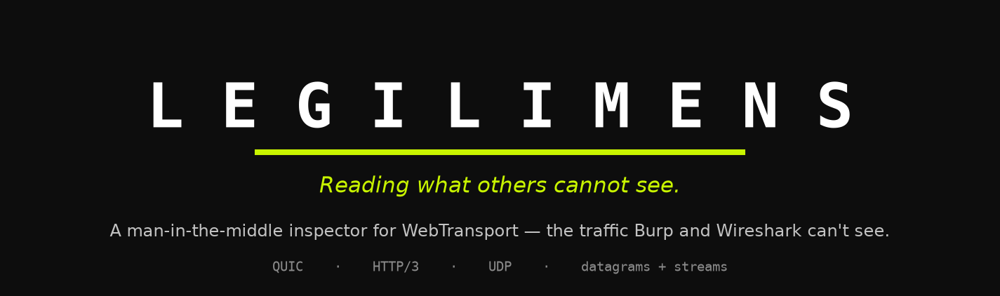
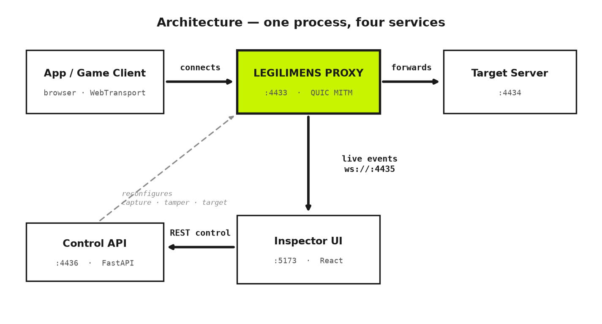
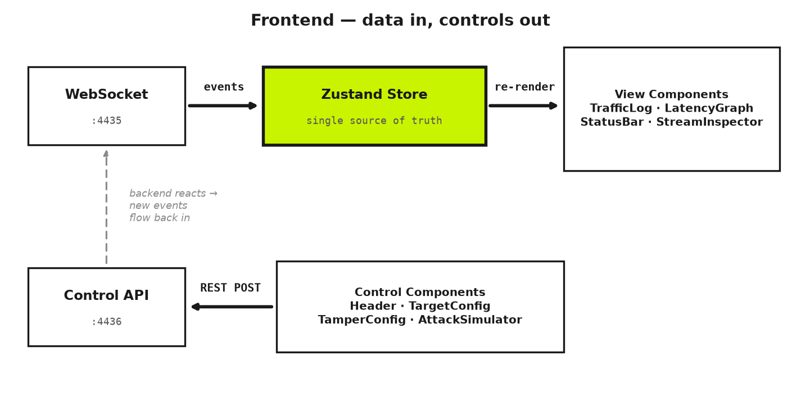

<div align="center">



[](https://www.python.org/)
[](https://github.com/aiortc/aioquic)
[](https://fastapi.tiangolo.com/)
[](https://react.dev/)
[](https://www.typescriptlang.org/)
[](https://vitejs.dev/)
[](#license)

**A man-in-the-middle inspector for WebTransport — the traffic Burp Suite and Wireshark can't see.**

Part of the **Hallows** security toolkit.

</div>

---

## What is Legilimens?

Legilimens is a MITM proxy and live inspector purpose-built for [WebTransport](https://developer.chrome.com/docs/capabilities/web-apis/webtransport) — the modern browser API for bidirectional, low-latency communication over HTTP/3 (QUIC / UDP).

A client connects to Legilimens **thinking it is the real server**. Legilimens forwards everything upstream to the actual target (the man-in-the-middle position), logs every datagram and stream chunk, optionally rewrites traffic in flight, and streams a live copy of it all into a React dashboard.

> **Think of it as Burp Suite + Wireshark, but for a protocol existing tools can't reach.**

## Why WebTransport needs its own inspector

Burp and Wireshark were built for TCP. WebTransport runs over **QUIC**, which:

- Is **UDP-based** with its own self-contained **TLS 1.3** handshake at the QUIC layer — outside the OS/browser certificate trust chain a normal proxy intercepts.
- Supports **`serverCertificateHashes`** pinning: a client can trust one exact certificate hash with no CA involved, which makes the classic "swap in our own CA cert" MITM trick impossible.
- Multiplexes **datagrams and bidirectional streams** at once — a model TCP proxies don't natively understand.

Legilimens handles all of this by running a real WebTransport server as the proxy entry point, dialing the upstream target as a real WebTransport client, and relaying traffic bidirectionally at the application layer — all while broadcasting a live feed to the UI.

---

## Architecture



The whole backend runs as **one Python asyncio process** (`python/backend.py`) hosting four services:

| Port | Service | Protocol | File |
|------|---------|----------|------|
| `4433` | MITM proxy — browser/client connects here | WebTransport (QUIC/UDP) | `python/proxy.py` |
| `4434` | Deliberately vulnerable target server | WebTransport (QUIC/UDP) | `python/vulnerable_server.py` |
| `4435` | Live event broadcaster → React UI | WebSocket | `python/logger.py` |
| `4436` | Control API (capture / tamper / target / attack) | HTTP (FastAPI) | `python/api.py` |
| `5180` | React inspector UI | HTTP (Vite dev server) | `client/` |

> The backend was **migrated from Node.js to Python** (`aioquic`). The original Node implementation is kept under `server/` for reference but is no longer used. The React UI is unchanged — same API contract.

---

## Features

- **Live capture** — every datagram and bidirectional stream chunk, in real time, in a scrolling log you can filter (`SUS` / `TAMPERED` / `NORMAL` / `CONN`) and full-text search.
- **Capture controls** — `START` (capture), `PAUSE` (hold the wire, connection stays alive), `DISCONNECT` (hard cut).
- **Conditional tamper** — rewrite a JSON field in passing traffic, optionally only when another field matches (e.g. *change `score` to `99999`, but only where `playerName = Seeker`*).
- **Runtime target switching** — point the proxy at a different upstream WebTransport server without restarting.
- **Manual intercept** — hold a datagram/stream mid-flight, then **edit, forward, or drop** it (Burp-style Intercept), scoped by direction/type with a timeout.
- **Repeater** — resend or **inject** an (edited) message into the live session — to the server or back to the client.
- **Suspicious-data flagging** — payloads containing `token` / `auth` / `bearer` / passwords are auto-flagged.
- **Attack simulator** — connection floods, slow-loris cycles, and more, launched from the UI with live progress (see [Attacks](#the-vulnerable-target--attacks)).
- **Cert helper** — the cert hash for `serverCertificateHashes` is served at `/cert-hash` and shown in the UI with a copy button.

---

## Quick start

### Prerequisites
- **Python 3.10+**
- **Node.js 18+** (for the React UI)
- **Chrome** or **Edge** — WebTransport is not supported in Firefox/Safari

### 1. Install dependencies

```bash
# Backend — an isolated Python environment (do NOT install globally)
python -m venv .venv
.venv\Scripts\activate          # Windows
# source .venv/bin/activate     # macOS / Linux
pip install -r python/requirements.txt

# Frontend — React/Vite dependencies (installs into client/)
npm run install-ui              # = npm --prefix client install
```

### 2. Run it (one command)

```bash
npm run dev
```

This **regenerates the TLS cert**, starts the **backend** (proxy `:4433`, target `:4434`, WS log `:4435`, API `:4436`), and starts the **UI** on **http://localhost:5180** — all in one terminal. `Ctrl+C` stops everything.

> The cert is a self-signed **ECDSA P-256** cert (Chromium rejects RSA here), generated with the `cryptography` library — **no OpenSSL needed**. It is valid for 13 days, and `npm run dev` re-mints it on every launch, so you never hit an expired cert.

### 3. Open the UI

Open **plain Chrome or Edge** at **http://localhost:5180** and click **▶ START** to open a WebTransport connection through the proxy.

> **No launch flags needed.** Legilimens serves its cert hash at `/cert-hash`, and the UI connects with the WebTransport `serverCertificateHashes` API — so a normal browser trusts the self-signed cert without any `--origin-to-force-quic-on` / `--ignore-certificate-errors-spki-list` flags. (`npm run gen-cert` still prints those flags if you want the legacy path.)

> **No browser?** `python/test_client.py` is a CLI WebTransport client for testing:
> ```bash
> .venv\Scripts\python.exe python/test_client.py --count 5
> ```

<details>
<summary><b>Prefer to run the pieces separately?</b></summary>

```bash
npm run gen-cert     # regenerate the cert only
npm start            # backend only  (= python python/backend.py)
npm run start-ui     # UI only, on http://localhost:5180
```
</details>

---

## Frontend architecture

The inspector UI is a **React 18 + TypeScript** app built on one rule: **data flows one way.** There are two paths, and together they form a loop.



- **Data in (read path).** An auto-reconnecting WebSocket pushes live events into a single **Zustand store** — the one source of truth. It routes each event by `type` (traffic / attack / intercept), updates derived counters, and flags risky payloads. View components subscribe and re-render; **no component keeps its own copy of the data**.
- **Controls out (write path).** Clicking a button — start, pause, set a tamper rule, change the target, run an attack — sends a **REST** request to the control API. The backend acts, and the results come back as new events over the WebSocket. That closes the loop.
- **Why it's built this way.** Components split cleanly into **controls** (which write) and **views** (which read), so the app is easy to reason about. Non-serializable objects (the WebSocket, the browser `WebTransport` session) live outside the store as module variables, keeping the store pure render-state. Because the log can update tens of times a second, selector subscriptions keep re-renders scoped to only the components that use each slice.

---

## Control API (`:4436`)

Everything the UI does goes through this FastAPI surface:

| Method & path | Purpose |
|---|---|
| `POST /intercept` `{action: "start"\|"pause"\|"disconnect"}` | Capture control |
| `GET/POST /tamper` `{enabled, field, value, matchField, matchValue}` | Rewrite a JSON field in passing traffic (conditional) |
| `GET/POST /target` `{host, port, certHash}` | Switch the upstream target |
| `GET /cert-hash` | Base64 `SHA-256(DER)` cert hash for `serverCertificateHashes` |
| `GET /health` | Liveness check |
| `POST /attack` `{type, params}` → `{attackId}` | Launch an attack |
| `GET /attack/{id}/status` · `POST /attack/{id}/stop` | Track / stop a running attack |

Example — enable a conditional tamper rule:

```bash
curl -X POST http://localhost:4436/tamper -H 'Content-Type: application/json' \
  -d '{"enabled":true,"field":"score","value":"99999","matchField":"playerName","matchValue":"Seeker"}'
```

Tampered messages appear with an orange **`TAMPERED`** badge in the traffic log.

---

## Vulnerable practice apps

Beyond the bundled target, **`vuln_apps/`** is a suite of tiny, **deliberately-insecure** WebTransport apps — one isolated flaw each — for practising against Legilimens. Every app is a headless `server.py` + a CLI `client.py`, with a `README.md` and a Markdown + Word report explaining the bug, the exploit, and the fix.

| App | Vulnerability | Port | Legilimens shows |
|---|---|---|---|
| `01_no_auth` | Missing authentication (CWE-306) | `4451` | **watches** — session granted with no credential |
| `02_trust_client` | Trusting client input (CWE-602) | `4452` | **tampers** — forge a value in flight |
| `03_secret_leak` | Sensitive data exposure (CWE-200) | `4453` | **auto-flags** — secrets in the payload |
| `04_stored_xss` | No input validation / stored XSS (CWE-79) | `4454` | **injects** — plant a payload via the Repeater |
| `05_no_rate_limit` | No rate limiting / brute-force (CWE-307) | `4455` | **floods** — watch a brute-force live |

```bash
npm run vulns        # start all of them together
npm run vuln-3       # start just one (here: 03_secret_leak on :4453)
```

Then point Legilimens at that app's port (**Upstream Target → `127.0.0.1:445X` → Apply**) and run its client through the proxy:

```bash
.venv\Scripts\python.exe vuln_apps\03_secret_leak\client.py --port 4433
```

> These are **local practice targets only** — they use fake demo data and intentionally omit defences. Each app's `README.md` walks through exploiting and fixing it.

---

## The vulnerable target & attacks

`python/vulnerable_server.py` is a deliberately insecure WebTransport server used as a safe practice target. It has **no authentication**, **leaks a session token** in periodic heartbeat datagrams, **echoes any payload** without validation, and **applies no rate limiting**.

The attack simulator (`python/attacks/`, orchestrated by `python/attack_runner.py`) ships five attacks, launched from the UI with live progress:

| Attack | What it does | Status |
|---|---|---|
| `flooding` | Many parallel QUIC handshakes | ✅ Real |
| `loris` | Slow handshake/drop cycles (slow-loris style) | ✅ Real |
| `encapsulation` | Raw QUIC packets via Scapy | ⚠️ Needs Administrator + Npcap |
| `fuzz` | Hand-built QUIC Initial packets | ⚠️ Currently inert — see [caveats](#status--honest-caveats) |
| `out_of_joint` | Out-of-order QUIC probes | ⚠️ Currently inert — see [caveats](#status--honest-caveats) |

---

## Project structure

```
python/
  backend.py            entry point — runs all four services on one asyncio loop
  proxy.py              MITM proxy :4433  (capture, conditional tamper, intercept, repeater)
  vulnerable_server.py  deliberately insecure target :4434
  logger.py             WebSocket event broadcaster :4435
  api.py                FastAPI control API :4436
  certs.py              ECDSA P-256 cert generation -> python/certs/ (gitignored)
  udp_fix.py            Windows SIO_UDP_CONNRESET fix (keeps the UDP listener alive on reload)
  attack_runner.py      attack lifecycle + live progress over the WS
  attacks/              flooding · loris · fuzz · out_of_joint · encapsulation
  test_client.py        CLI WebTransport client for browser-free testing

client/src/
  store/useStore.ts     Zustand store (state, actions, WS event routing)
  components/            Header · TrafficLog · StreamInspector · Repeater · InterceptPanel
                        StatusBar · TargetConfig · TamperConfig · AttackSimulator · ServerInfoBar

scripts/
  start-all.js          `npm run dev`   — cert + backend + UI, one command
  start-vulns.js        `npm run vulns` / `vuln-N` — the vuln_apps launchers

vuln_apps/              deliberately-insecure practice apps (server + client + report each)
assets/                 README images (committed) + generate_assets.py to rebuild them
server/                 original Node.js backend — kept for reference, not used
```

---

## Status & honest caveats

Legilimens is a **strong working prototype**, not a shipped product. What's solid and what isn't:

**Works end to end:** datagram + bidirectional-stream MITM, conditional tamper, **manual intercept (edit / forward / drop)**, **repeater (resend / inject)**, suspicious-keyword flagging, capture start/pause/disconnect, session teardown under load, runtime target switching, and the `flooding` / `loris` attacks (real QUIC handshakes). Verified end-to-end against **real Chrome** (via `serverCertificateHashes`, no launch flags) and across the whole `vuln_apps/` suite.

**Known limitations:**
- **`fuzz` and `out_of_joint` are inert** — they send unprotected, hand-built QUIC Initial packets that a compliant server silently drops. Honest about it (they report `0` responses); making them real needs proper Initial-packet crypto (HKDF secrets, header protection, AEAD, 1200-byte padding).
- **No automated scanner or fuzzer (Intruder-style)** — Legilimens is Burp's *manual core* (proxy, repeater, intercept). Automated brute-force / fuzzing is done today by external scripts (see `vuln_apps/05_no_rate_limit`), not yet in-tool.
- **`serverCertificateHashes` pinning caps real-world MITM** — you can inspect apps whose client you control (your own / test builds); a shipped client that pins its own cert can't be intercepted. This blocks *every* MITM tool equally (Burp, mitmproxy), not just Legilimens.
- **Tamper is per-chunk** — JSON split across multiple stream chunks won't match.
- **No persistence / export** yet; the in-memory log is capped at 500 events.

---

## Roadmap

- **Intruder-style attack tool** — fire a payload list / range at an injection point from the UI (automated brute-force / fuzzing — the one big Burp feature still missing).
- **Real `fuzz` / `out_of_joint`** — proper QUIC Initial-packet construction.
- **Session export** — save captures as NDJSON / HAR-like for offline analysis.
- **List virtualization** — render only visible log rows for high-volume captures.
- **Electron packaging** — bundle backend + UI into one launchable app.

---

## Part of Hallows

Legilimens is the first tool in the **Hallows** security toolkit — purpose-built instruments for protocols and attack surfaces that mainstream tools cannot reach.

> *"For when the Deathly Hallows are not enough."*

---

## License

MIT

---

<!-- <div align="center">
<sub>Diagrams are generated by <code>assets/generate_assets.py</code> — edit that script and re-run it to update them.</sub>
</div> -->
