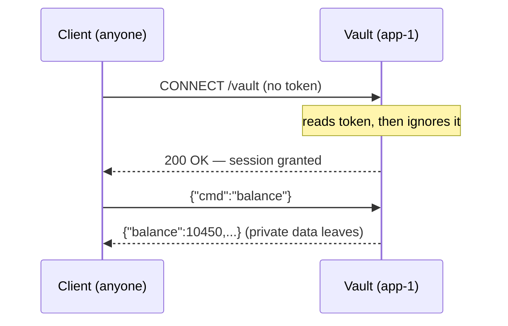
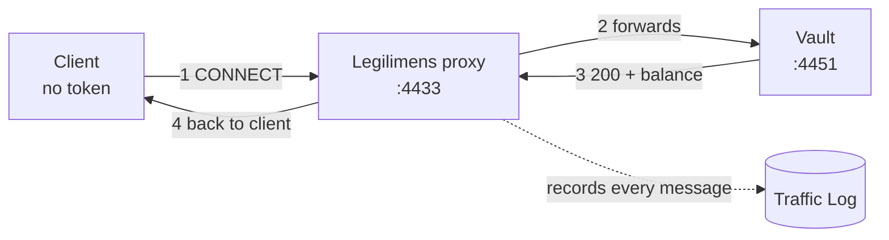
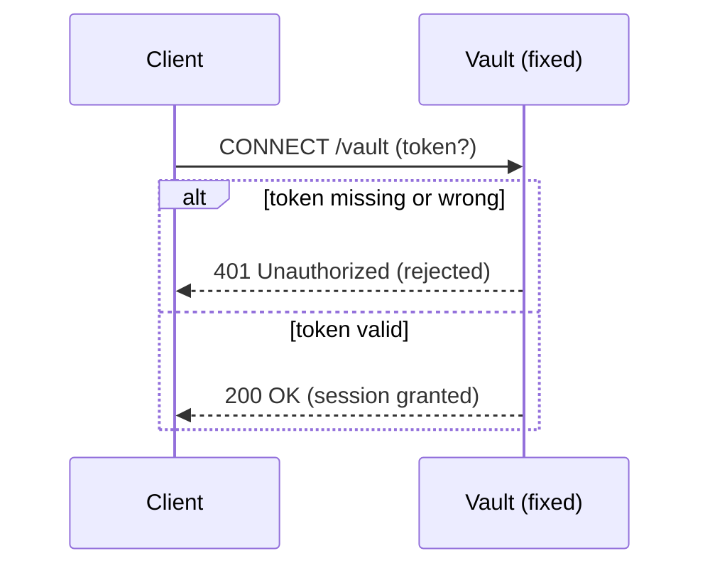

# Missing Authentication (CWE-306)

**App:** `01_no_auth` — a tiny WebTransport "vault" that serves a private account balance.
**The flaw:** it asks for a token, then never checks it. Anyone gets in.

> **Analogy:** a bank vault with a guard who says *"ID please?"*, glances away, and opens the
> door for everyone — even people holding no ID at all. The lock exists; nobody uses it.

---

## 1. How the vulnerable app works

The vault reads the `token` off the connection request and then just... opens the door.

```python
# server.py  — inside the CONNECT handler
token = parse_qs(urlparse(path).query).get("token", [None])[0]

# THE BUG: token is read above, then never checked — every connect gets 200 OK.
self._http.send_headers(stream_id=event.stream_id, headers=[(b":status", b"200")])
self._sessions.add(event.stream_id)          # session is now live
```

Once the session is open, it hands the private balance to whoever asks:

```python
if cmd == "balance":
    self._http.send_datagram(stream_id=event.stream_id, data=json.dumps(ACCOUNT).encode())
```



The whole problem: **the door opens before anyone is checked.**

---

## 2. How Legilimens is used against it

Legilimens is a **wiretap**. It sits between the client and the vault, forwards everything
so the app still works, and **records every message** so you can prove what happened.

> **Analogy:** a security camera in the hallway. It doesn't change the guard's behaviour —
> it just films the stranger walking in empty-handed and walking out with the cash.



Under the hood Legilimens accepts the client, bridges to the real vault, and logs each
message with a colour-coded **flag**:

```python
# proxy.py — every message that passes through is captured for the log
await broadcast_async(make_event(
    direction="incoming", etype="datagram",
    payload=payload,
    flag="suspicious" if is_suspicious(payload) else "normal",   # auto-classified
))
```

**What you see in the log:** `Session … connected via /vault` with **no credential**, then the
balance flowing back. That row *is* the proof the vault let a stranger read private data.

Run it yourself:

```
# point Legilimens at the vault, then run the client THROUGH the proxy (:4433)
.venv\Scripts\python.exe vuln_apps\01_no_auth\client.py --port 4433
```

---

## 3. How to make app-1 secure

Check the token **before** opening the session. Missing or wrong token → `401`, and stop.

```python
# server.py — the fix (already sitting commented-out next to the bug)
token = parse_qs(urlparse(path).query).get("token", [None])[0]

if token not in VALID_TOKENS:                                    # <-- the guard actually looks
    self._http.send_headers(stream_id=event.stream_id, headers=[(b":status", b"401")])
    self.transmit()
    return                                                       # door stays shut

# only valid tokens reach this line
self._http.send_headers(stream_id=event.stream_id, headers=[(b":status", b"200")])
```



After the fix, re-running the three clients through Legilimens shows the difference plainly:

| Client sends | Vulnerable app | Fixed app |
|---|---|---|
| no token | 200 — GRANTED | **401 — rejected** |
| `wrong-token` | 200 — GRANTED | **401 — rejected** |
| `tok-hermione-granger` | 200 — GRANTED | 200 — GRANTED |

---

## Takeaway

WebTransport (like HTTPS) gives you an **encrypted** channel, not an **authorised** one.
Encryption proves *nobody eavesdropped*; it says nothing about *who is on the other end*.
**Always authenticate the `CONNECT` and reject the session when the credential is missing or
invalid** — don't open the door and hope the caller behaves.
