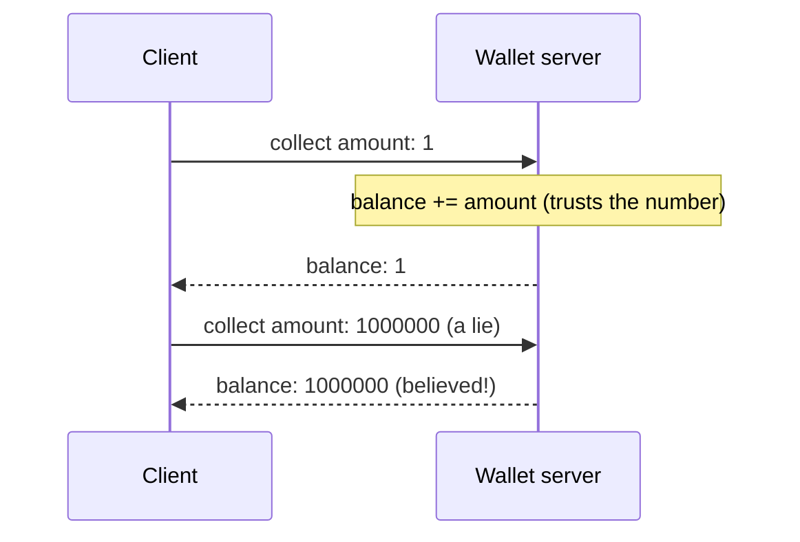
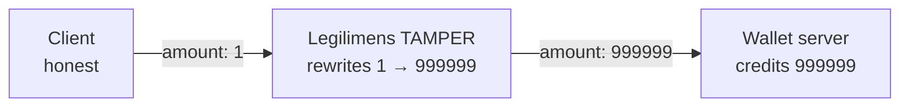
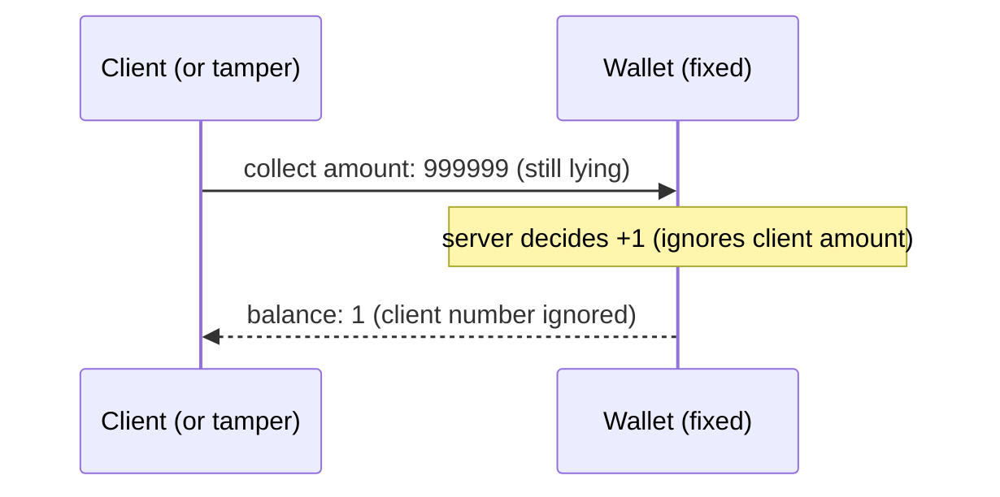

# Trusting the Client (CWE-602)

**App:** `02_trust_client` — a coin-wallet game server.
**The flaw:** the client says how many coins it collected, and the server adds that number to
the balance — it trusts a value the client fully controls.

> **Analogy:** a shop where you fill in your own receipt. You write "paid: $1,000,000" and the
> cashier files it without checking the till. Whatever you claim, they believe.

---

## 1. How the vulnerable app works

When the client reports a "collect", the server adds the client's own number to the balance:

```python
# server.py — inside the "collect" handler
amount = int(msg.get("amount", 0))
self.balance += amount          # THE BUG: the client's number is trusted as truth
```



Any client can lie — send a huge amount and the balance jumps. The server never questions it.

---

## 2. How Legilimens is used against it

Unlike app #1 (where Legilimens just *watched*), here it **actively attacks**: its Tamper
feature rewrites a value as the message passes through, so even an honest client's traffic
arrives forged.

> **Analogy:** in app #1 Legilimens was the security camera — it only filmed. Here it is the
> forger who intercepts your receipt in the mail and changes the number before it reaches the shop.



The proxy applies the tamper rule (field `amount` → 999999) to the datagram before forwarding:

```python
# proxy.py — the Tamper feature rewrites the chosen field as the message passes through
tampered, payload = tamper_payload(raw)          # rule: amount -> 999999
self.upstream.send_datagram(payload.encode())    # the SERVER receives the forged value
```

**What you see:** the honest client claims `1`, but the server replies `"credited": 999999`.
Legilimens changed the coin count in flight and the server trusted it.

Run it yourself (honest client through the proxy, with the amount tamper rule on):

```
.venv\Scripts\python.exe vuln_apps\02_trust_client\client.py --port 4433
```

---

## 3. How to make app-2 secure

Let the server decide the reward. The client's number becomes irrelevant — the server owns the balance.

```python
# server.py — the fix (commented next to the bug)
COIN_PER_COLLECT = 1
self.balance += COIN_PER_COLLECT     # ignore msg["amount"] entirely
```



Now it makes no difference whether the client is honest, cheating, or tampered:

| Client sends | Vulnerable app | Fixed app |
|---|---|---|
| `collect amount:1`  (honest) | +1 | +1 |
| `collect amount:1000000`  (cheat) | +1000000 | **+1** |
| `amount:1` tampered → 999999 | +999999 | **+1** |

---

## Takeaway

Never trust client-supplied values for state the **server** owns — money, score, inventory,
permissions. A value from the client is a *request*, not a *fact*. The server must compute or
verify authoritative state itself; encryption and even authentication don't help if you then
believe whatever the authenticated client tells you.
