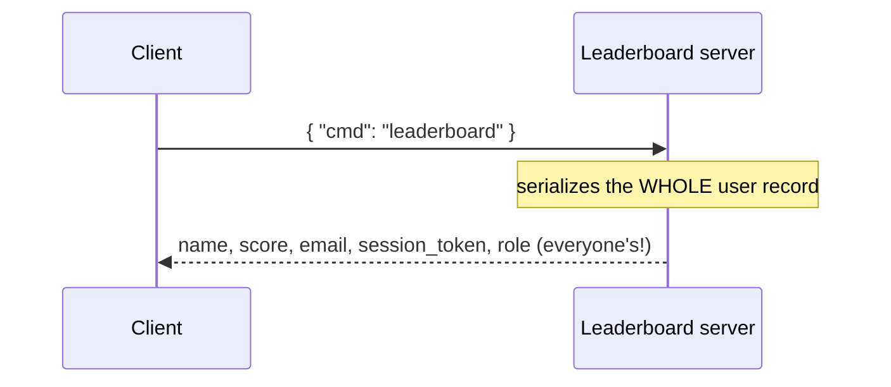
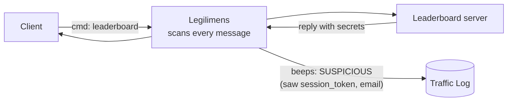
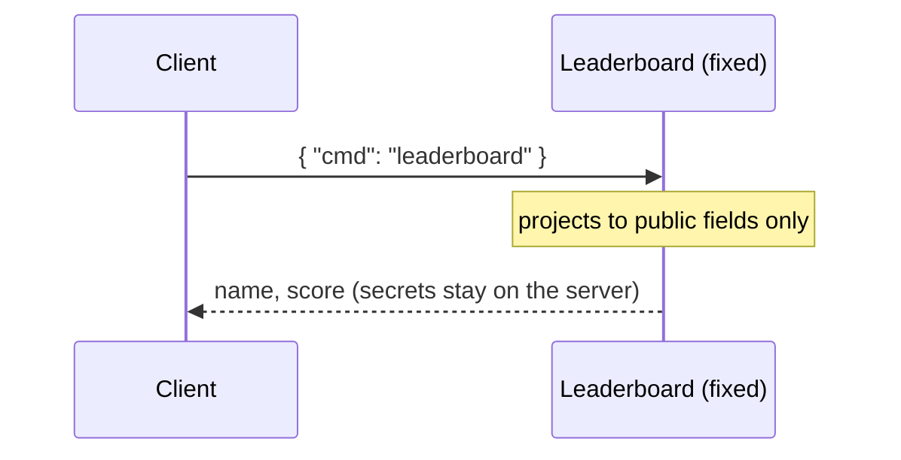

# Sensitive Data Exposure (CWE-200)

**App:** `03_secret_leak` — a leaderboard server.
**The flaw:** asked for the leaderboard, the server sends back its **whole internal user
record** for every player — `email`, `session_token`, `role` — instead of just `name` and
`score`. Anyone who connects reads everyone's secrets.

> **Analogy:** you ask the front desk for the guest list, and they hand you a printout with
> everyone's name **plus room number, credit card, and passport**. You only needed names.

---

## 1. How the vulnerable app works

The handler serializes the full internal record straight to the client:

```python
# server.py — inside the "leaderboard" handler
board = {"type": "leaderboard", "players": USERS}   # THE BUG: USERS has email/session_token/role
self._http.send_datagram(stream_id=event.stream_id, data=json.dumps(board).encode())
```



The client only needed names and scores — it received everyone's private fields too.

---

## 2. How Legilimens is used against it

This is the **passive-detection** side. You set **no tamper rule and intercept nothing** — you
just capture. The moment the leaky reply flows through, Legilimens **auto-flags it SUSPICIOUS**
because it spots keywords like `session_token`, `token`, and `secret`.

> **Analogy:** in app #1 Legilimens was the security camera (watched), in app #2 the forger
> (attacked). Here it is the **metal detector** — it beeps by itself when something it
> shouldn't-be-there passes through.



```
# no config needed — just point Legilimens at the server, capture, and run the client
.venv\Scripts\python.exe vuln_apps\03_secret_leak\client.py --port 4433
```

**What you see:** the reply row is flagged **SUSPICIOUS** and the SUSPICIOUS counter climbs on
its own. The tool surfaced the leak just by watching.

---

## 3. How to make app-3 secure

Send only a **public projection** — the fields the client actually needs. Keep the rest server-side.

```python
# server.py — the fix (commented next to the bug)
public = [{"name": u["name"], "score": u["score"]} for u in USERS]
board = {"type": "leaderboard", "players": public}     # no email / token / role
```



| What the server sends | Vulnerable app | Fixed app |
|---|---|---|
| `name`, `score` | ✅ sent | ✅ sent |
| `email` | ❌ **leaked** | 🔒 kept server-side |
| `session_token` | ❌ **leaked** | 🔒 kept server-side |
| `role` | ❌ **leaked** | 🔒 kept server-side |

---

## Takeaway

Never serialize your internal model to the client. Send only the fields it needs; keep tokens,
PII, and roles on the server. **Encryption protects the payload in transit — it does nothing
about what you choose to put in that payload.** A secure transport carrying secrets is still a leak.
