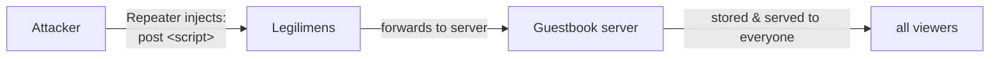

# Stored Cross-Site Scripting / No Input Validation (CWE-79)

**App:** `04_stored_xss` — a guestbook server.
**The flaw:** clients post a message; the server stores it **verbatim** and serves it to every
viewer. It never validates or escapes the text, so `<script>...</script>` is stored as-is and
runs in the browser of anyone who views the guestbook.

> **Analogy:** a public noticeboard where the staff pin whatever note you hand them, word for
> word — including a note rigged to shout in the face of everyone who later reads the board.

---

## 1. How the vulnerable app works

The `post` handler stores the raw text; `list` hands it back to everyone:

```python
# server.py — inside the "post" handler
text = msg.get("text", "")
MESSAGES.append(text)          # THE BUG: stored verbatim — no validation, no escaping
```

```mermaid
sequenceDiagram
    participant A as Attacker
    participant S as Guestbook server
    participant V as Victim (viewer)
    A->>S: post "&lt;script&gt;steal()&lt;/script&gt;"
    Note over S: stored verbatim (no escaping)
    V->>S: list
    S-->>V: ...&lt;script&gt;steal()&lt;/script&gt;...
    Note over V: the browser RUNS the script
```

One attacker poisons the shared guestbook; every later viewer runs the attacker's code.

---

## 2. How Legilimens is used against it

Unlike app #2 (which *changed* a value in flight), here Legilimens **injects a whole message the
client never sent** — using the **Repeater** to send a crafted `post` straight to the server.

> **Analogy:** in app #2 Legilimens forged a number on your receipt; here it slips an extra,
> booby-trapped note into the mailbag before it reaches the noticeboard.



Under the hood the Repeater drops a datagram straight into the live session, as if the client
sent it:

```python
# proxy.py — the Repeater injects a datagram into the live session (as the client)
session.upstream.send_datagram(payload.encode())   # payload = the attacker's script post
```

```
# run a client so a session is live, then use the UI's Repeater -> TO SERVER:
{"cmd":"post","text":"<script>LEGILIMENS_INJECTED</script>"}
```

**What you see:** the injected `<script>` lands in the guestbook and is served to everyone —
a payload no real client ever typed.

**Honest note:** the script only *executes* when a UI renders the guestbook as HTML (e.g. via
`innerHTML`). The server storing raw markup is the root cause — that's what this app proves.

---

## 3. How to make app-4 secure

Validate and escape on the way **in**. Then rendering it later is harmless.

```python
# server.py — the fix (commented next to the bug)
import html
text = str(msg.get("text", ""))[:280]     # length limit
text = html.escape(text)                  # <script> -> &lt;script&gt;
MESSAGES.append(text)
```

```mermaid
sequenceDiagram
    participant A as Attacker
    participant S as Guestbook (fixed)
    participant V as Victim
    A->>S: post "&lt;script&gt;steal()&lt;/script&gt;"
    Note over S: html.escape() neutralises it
    V->>S: list
    S-->>V: shown as plain text, not run
```

| Message posted | Vulnerable app | Fixed app |
|---|---|---|
| `hello` | stored, shown as text | stored, shown as text |
| `<script>steal()</script>` | **stored raw → runs in viewers** | escaped → shown as harmless text |

---

## Takeaway

Never store or serve untrusted input unvalidated. **Validate and escape on the way in** (length
limits, allow-lists, `html.escape`) and **escape on the way out** when rendering. Treat every
byte from a client as hostile — a secure transport carries the attacker's `<script>` just as
faithfully as a real message.
