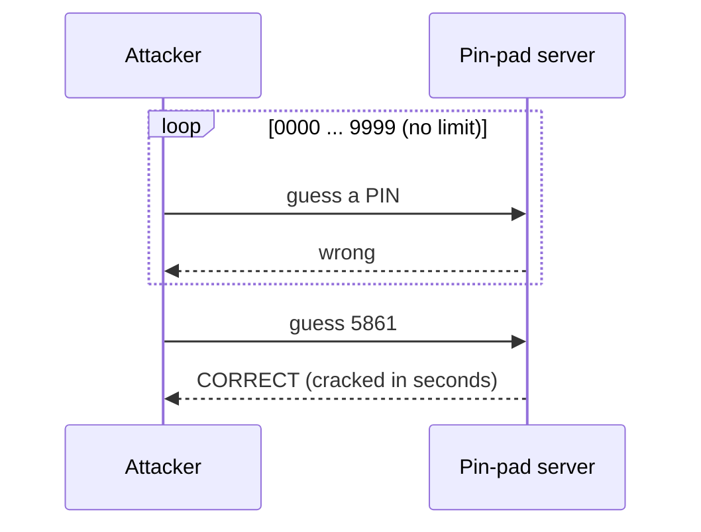
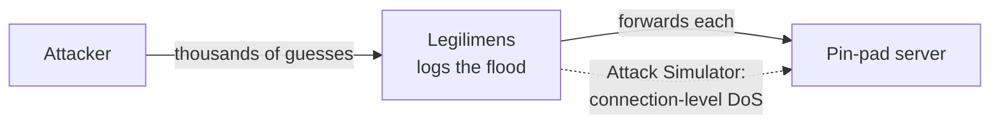
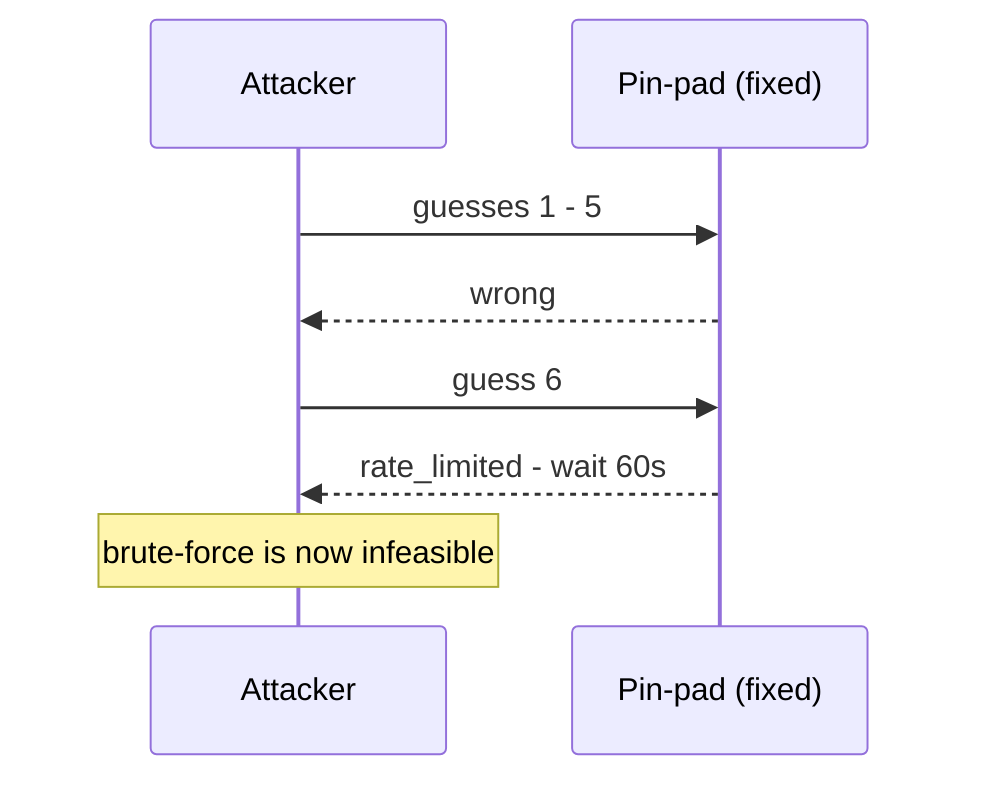

# No Rate Limiting / Brute-Force (CWE-307)

**App:** `05_no_rate_limit` — a vault pin-pad.
**The flaw:** a client sends a 4-digit PIN guess and the server says right or wrong — and it
answers **every** guess instantly, with no per-client limit and no lockout. So a client can try
all 10,000 combinations in seconds and brute-force the secret.

> **Analogy:** a padlock you can try keys on as fast as you like, forever. Your phone locks
> after a few wrong PINs; this door lets you try 10,000 in a row without blinking.

---

## 1. How the vulnerable app works

Each guess is checked and answered — the attempt is counted, but never **limited**:

```python
# server.py — inside the "guess" handler
self._attempts += 1                       # counted, but nothing caps it  <- THE BUG
pin = str(msg.get("pin", ""))
reply = {"result": "correct"} if pin == SECRET_PIN else {"result": "wrong"}
```



A 4-digit PIN has only 10,000 possibilities — trivial to exhaust when nothing slows you down.

---

## 2. How Legilimens is used against it

Here Legilimens is the **watcher of a flood**: the brute-force streams through the proxy and
every guess lands in the traffic log, so you *see* the attack happening. Its **Attack
Simulator** (QUIC-flooding / QUIC-loris) can also pile on a connection-level DoS.

> **Analogy:** app #4 slipped one booby-trapped note in; here Legilimens is the CCTV watching
> someone try every key on the lock — and it can jam the door itself too.



Nothing special is configured — the normal per-message logging captures the whole flood:

```python
# proxy.py — every datagram (each brute-force guess) is logged as it passes through
await broadcast_async(make_event(direction="incoming", etype="datagram", payload=payload, ...))
```

**What you see:** the log fills with `{"cmd":"guess",...}` datagrams — a brute-force made visible.

---

## 3. How to make app-5 secure

Throttle per client and lock out after repeated failures.

```python
# server.py — the fix (commented next to the bug)
import time
self._recent = [t for t in self._recent if time.time() - t < 60]
if len(self._recent) >= 5:                 # max 5 guesses per minute
    reply = {"result": "rate_limited", "retry_after": 60}
    ...send and return...
self._recent.append(time.time())
```



| | Vulnerable app | Fixed app |
|---|---|---|
| Guesses allowed | **unlimited** | ~5, then locked out |
| Time to crack a 4-digit PIN | **~8 seconds** | infeasible |

---

## Takeaway

Rate-limit anything an attacker can repeat: logins, PIN/OTP checks, password resets, API calls.
**Throttle per client and lock out after repeated failures.** The short PIN is *not* the bug — a
4-digit PIN is fine *with* a "5 tries then wait" rule. The bug is the **missing limit**.
